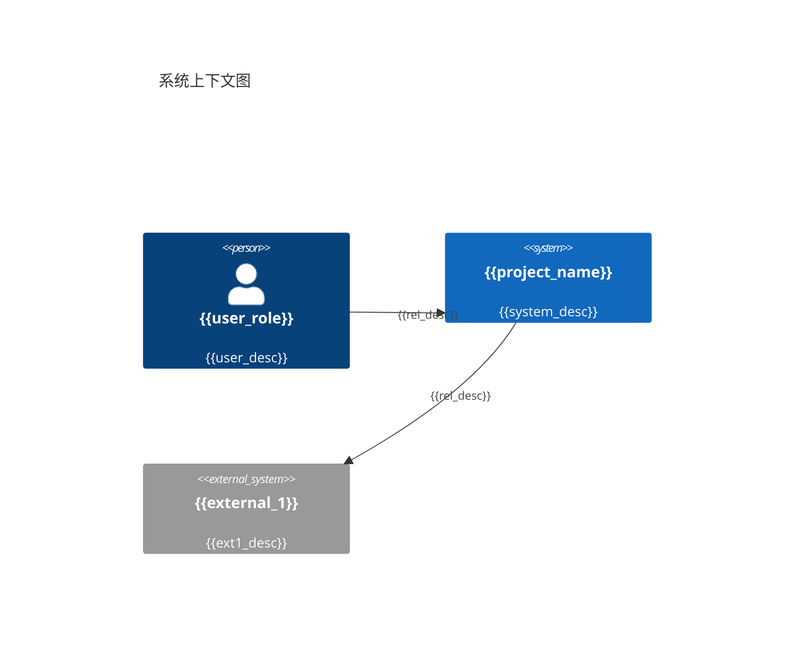
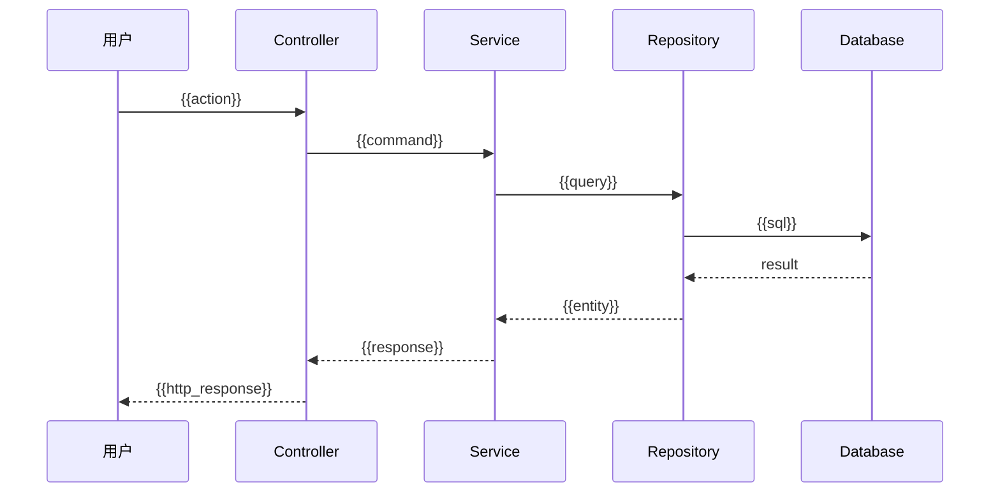

# {{project_name}} — 应用架构设计文档

> 基于 Arc42 模板 | 设计深度: {{design_depth}} | 生成日期: {{date}}

---

## 1. 引言与目标

### 1.1 需求概览

{{project_background}}

### 1.2 质量目标

| 优先级 | 质量属性 | 具体目标 |
|--------|---------|---------|
| 1 | {{quality_1}} | {{quality_1_target}} |
| 2 | {{quality_2}} | {{quality_2_target}} |
| 3 | {{quality_3}} | {{quality_3_target}} |

### 1.3 利益相关者

| 角色 | 关注点 | 期望 |
|------|--------|------|
| {{stakeholder_1}} | {{concern_1}} | {{expectation_1}} |

---

## 2. 约束

### 2.1 技术约束

| 约束 | 说明 | 对架构的影响 |
|------|------|-------------|
| {{tech_constraint_1}} | {{desc}} | {{impact}} |

### 2.2 组织约束

| 约束 | 说明 | 对架构的影响 |
|------|------|-------------|
| {{org_constraint_1}} | {{desc}} | {{impact}} |

---

## 3. 上下文与范围

### 3.1 业务上下文



### 3.2 限界上下文全景

```mermaid
graph TB
  subgraph "{{project_name}}"
    {{bc_1}}[{{bc_1_name}}]
    {{bc_2}}[{{bc_2_name}}]
  end

  {{bc_1}} -->|{{relation_type}}| {{bc_2}}
```

---

## 4. 解决方案策略

| 目标 | 策略 | 实现方式 |
|------|------|---------|
| {{goal_1}} | {{strategy_1}} | {{approach_1}} |

**架构风格**：{{architecture_style}}

**选择理由**：{{style_rationale}}

---

## 5. 构建块视图

### 5.1 Level 1 — 限界上下文

| BC 名称 | 域分类 | 职责 | 关键聚合 |
|---------|--------|------|---------|
| {{bc_1_name}} | {{domain_type}} | {{responsibility}} | {{aggregates}} |

### 5.2 Level 2 — BC 内部结构

#### {{bc_1_name}}

```
{{bc_1_name}}/
├── domain/          # 领域层
│   ├── {{aggregate_1}}.py
│   └── events.py
├── application/     # 应用层
│   └── {{use_case_1}}.py
├── adapters/        # 适配层
│   ├── inbound/
│   └── outbound/
└── ...
```

### 5.3 Level 3 — 聚合结构

```mermaid
classDiagram
  class {{AggregateRoot}} {
    +{{id_type}} id
    +{{method_1}}()
  }
  class {{Entity1}} {
    +{{id_type}} id
  }
  class {{ValueObject1}} {
    +{{field_1}}
    +equals(other)
  }

  {{AggregateRoot}} *-- {{Entity1}}
  {{AggregateRoot}} *-- {{ValueObject1}}
```

---

## 6. 运行时视图

### 场景: {{scenario_name}}



---

## 8. 横切概念

### 8.1 异常处理

{{exception_strategy}}

### 8.2 日志规范

{{logging_strategy}}

### 8.3 认证鉴权

{{auth_strategy}}

### 8.4 数据验证

{{validation_strategy}}

### 8.5 事务管理

{{transaction_strategy}}

### 8.6 领域事件

{{event_strategy}}

---

## 9. 架构决策

{{adr_list}}

---

## 10. 质量需求

### 质量树

```
质量目标
├── {{quality_1}}
│   └── {{scenario_1}}
├── {{quality_2}}
│   └── {{scenario_2}}
└── {{quality_3}}
    └── {{scenario_3}}
```

---

## 11. 风险与技术债务

| # | 风险描述 | 概率 | 影响 | 缓解策略 |
|---|---------|------|------|---------|
| 1 | {{risk_1}} | {{prob}} | {{impact}} | {{mitigation}} |

---

## 12. 术语表

| 术语 | 定义 | 所属上下文 |
|------|------|-----------|
| {{term_1}} | {{definition_1}} | {{context_1}} |

---

## 附录：项目目录结构

```
{{directory_tree}}
```
