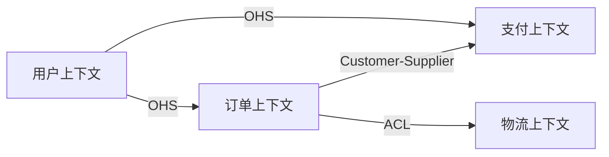

# DDD 战略设计指南

## 概述

战略设计从**业务视角**出发，划分领域边界，核心产出是限界上下文（Bounded Context）和上下文映射（Context Map）。

## 统一语言（Ubiquitous Language）

统一语言是 DDD 的基石——开发与业务专家使用相同的术语描述同一概念，消除沟通歧义。

**建立方法**：
1. 从业务描述中提取核心名词和动词
2. 为每个术语定义精确含义和使用范围
3. 标识同一词语在不同上下文中的含义差异（这是 BC 划分的关键线索）
4. 形成术语表，团队共同维护

**重要信号**：当同一个词在不同场景有不同含义时（如"订单"在销售和物流中含义不同），这通常意味着需要划分不同的限界上下文。

## 限界上下文划分（Bounded Context）

### 什么是限界上下文

限界上下文是一个明确的边界，在这个边界内，领域模型保持一致性。不同 BC 内可以有同名但含义不同的概念。

### 划分原则

| 原则 | 说明 | 信号 |
|------|------|------|
| **语言边界** | 同一术语含义发生变化的地方 | "这里的用户和那边的用户不一样" |
| **业务能力边界** | 独立的业务功能域 | 可以独立交付价值的能力集 |
| **团队边界** | 不同团队负责的范围 | Conway 定律：系统结构映射组织结构 |
| **数据一致性边界** | 需要强一致性的数据范围 | 必须在同一事务中完成的操作 |

### Event Storming 识别法

Event Storming 是从业务事件出发发现 BC 边界的协作工作坊方法：

**工作坊流程**：
1. 用橙色便利贴写下所有领域事件（已发生的事实），按时间线排列
2. 用蓝色便利贴标注触发每个事件的命令（Command）
3. 用黄色便利贴标注执行命令的参与者（Actor）
4. 用紫色便利贴标注自动化策略（Policy）
5. 退后观察，寻找天然的分组和边界

**从事件到 BC 的启发式方法**：
- **关键事件（Pivotal Events）**：业务流程的天然转折点是 BC 边界的候选
- **跟踪价值流转**：价值/资金流转的不同阶段通常对应不同 BC
- **角色视角**：不同角色拥有独立的上游处理流，仅在下游汇聚

### 划分步骤

1. 从 Step 1 的业务能力清单出发
2. 使用 Event Storming 思维识别事件聚集区域
3. 按语言边界、业务能力、团队对齐进行分组
4. 为每个 BC 命名并描述其核心职责
5. 验证：每个 BC 是否高内聚低耦合？

### BC 描述模板

```markdown
### BC: {{name}}

- **核心职责**：{{一句话描述}}
- **包含概念**：{{该 BC 内的主要领域概念}}
- **关键事件**：{{该 BC 产生或消费的主要领域事件}}
- **团队归属**：{{负责团队}}
```

## 上下文映射（Context Map）

### 7 种关系模式

| 模式 | 定义 | 适用场景 | 集成方式 |
|------|------|----------|----------|
| **Partnership** | 两团队紧密协作，共同演进 | 目标一致、高度信任 | 共同规划、同步发布 |
| **Shared Kernel** | 共享一小部分模型代码 | 少量紧密耦合的核心概念 | 共享代码库，协商修改 |
| **Customer-Supplier** | 上游供应，下游消费 | 明确的服务关系 | 上游提供 API，考虑下游需求 |
| **Conformist** | 下游完全采用上游模型 | 对接强势外部系统 | 下游适配上游格式 |
| **Anti-Corruption Layer** | 在两 BC 间插入翻译层 | 对接遗留系统/外部系统 | 翻译层隔离模型污染 |
| **Open Host Service** | 提供标准化协议供多方使用 | 平台型服务 | 公开 API + 文档 |
| **Separate Ways** | 完全独立，不集成 | 业务关联极低 | 各自独立实现 |

### 关系选择决策

- 团队关系好、目标一致 → Partnership 或 Shared Kernel
- 有明确的上下游依赖 → Customer-Supplier
- 对接外部强势系统且无法协商 → Conformist 或 ACL
- 需要保护内部模型不受外部污染 → Anti-Corruption Layer
- 作为平台服务多方调用 → Open Host Service
- 集成成本大于收益 → Separate Ways

### Context Map 输出格式

使用 Mermaid flowchart 展示 BC 间关系：



## 域分类（Domain Classification）

| 分类 | 定义 | 投资策略 |
|------|------|----------|
| **核心域（Core Domain）** | 企业核心竞争力，区别于竞争对手 | 自研精打，投入最优秀的团队 |
| **支撑域（Supporting Subdomain）** | 辅助核心业务，有一定个性化需求 | 适度投入，可外包但需定制 |
| **通用域（Generic Subdomain）** | 通用解决方案，无差异化需求 | 尽量复用/采购现有方案 |

**分类决策问题**：
- 这个 BC 是否直接产生商业价值？→ 核心域
- 这个 BC 是否可以用通用产品替代？→ 通用域
- 这个 BC 有个性化需求但不是核心竞争力？→ 支撑域
