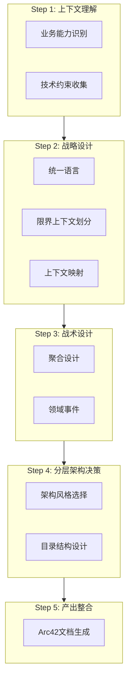
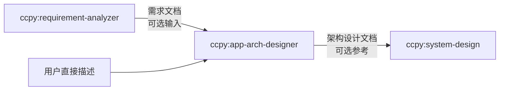

# 应用架构设计方法论概述

本技能融合 **DDD 领域驱动设计**、**分层架构模式**和 **Arc42 文档模板**，形成一套完整的应用架构设计流程。

## 方法论来源

### DDD 领域驱动设计

Eric Evans 提出的软件设计方法，通过建立统一语言和领域模型来应对业务复杂性：

- **战略设计**：划分限界上下文、建立上下文映射、识别核心域
- **战术设计**：设计聚合、实体、值对象、领域事件等构建块

### 分层架构模式

三种主流的应用内部架构组织方式：

| 风格 | 核心思想 | 适用场景 |
|------|----------|----------|
| Clean Architecture | 依赖规则向内，内层不依赖外层 | 复杂领域、长期演进 |
| Hexagonal (Ports & Adapters) | 应用核心通过端口与外部通信 | 多端口集成、可替换基础设施 |
| Vertical Slice | 按功能切片组织代码 | 功能独立性高、团队并行 |

### Arc42 文档模板

Peter Hruschka & Gernot Starke 提出的架构文档模板，12 个章节覆盖架构描述的各个方面。本技能选取其中适用于应用架构的章节作为输出骨架。

## 方法论融合

将 DDD 和分层架构嵌入 5 步流程，Arc42 作为输出结构化模板：

## 与上下游 Skill 的衔接

### 上游：requirement-analyzer（可选）

如果用户已使用 requirement-analyzer 完成需求分析，可将其输出文档作为 Step 1 的输入：
- 主题域 → 限界上下文划分的初始参考
- 核心实体 → 聚合识别的候选输入
- 业务事件 → 领域事件识别的参考
- 质量需求 → 架构风格决策的约束

### 下游：system-design（可选）

本技能的输出可供 system-design 参考：
- BC 边界定义 → 系统组件划分
- Context Map → 服务间通信机制决策
- 聚合/领域事件 → 接口设计和数据模型

衔接是松耦合的——任一 skill 可独立使用，不强制前后依赖。

## 核心设计原则

### 1. 从领域出发，而非从技术出发

先理解业务，再决定技术方案。避免"先选框架再填充业务"的反模式。

### 2. 适度设计

- quick 深度：小型项目避免过度设计
- comprehensive 深度：大型系统确保分析充分
- 根据项目复杂度选择匹配的设计深度

### 3. 决策可追溯

每个重要架构决策以 ADR 格式记录：背景 → 可选方案 → 决策 → 影响。

### 4. 演进式架构

架构不是一次性交付物。输出的设计文档是当前最佳理解，随项目演进可持续更新。

## 参考资料

- [DDD 战略设计](ddd/strategic-design.md)
- [DDD 战术设计](ddd/tactical-design.md)
- [统一语言实践](ddd/ubiquitous-language.md)
- [Clean Architecture](architecture-styles/clean-architecture.md)
- [Hexagonal Architecture](architecture-styles/hexagonal.md)
- [Vertical Slice Architecture](architecture-styles/vertical-slice.md)
- [架构风格决策指南](architecture-styles/decision-guide.md)
- [Arc42 模板指南](arc42/template-guide.md)
