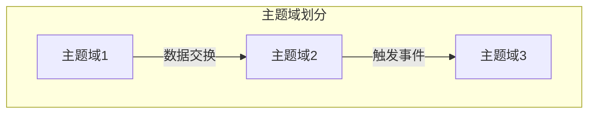
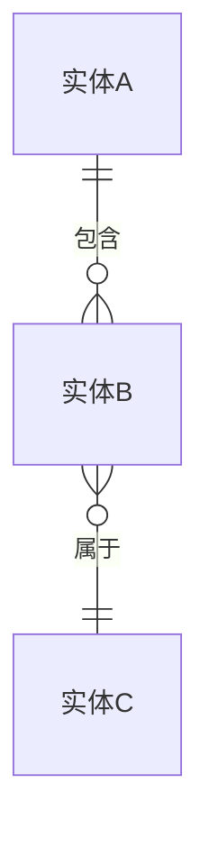

# 需求分析（徐峰方法论）

基于《有效需求分析（第二版）》，采用三阶段分析法系统化完成需求分析。

## 流程概述

```
阶段1: 明确目标和范围 → 阶段2: 理清脉络和框架 → 阶段3: 填充需求细节 → 输出需求文档
```

**三阶段分析法**：
1. **阶段1**：识别干系人、划分主题域、标示业务事件（SERU-S/E/R）
2. **阶段2**：建立领域模型和用例模型（SERU-U）
3. **阶段3**：细化用例、非功能需求、业务规则

**方法论参考**：[references/overview.md](references/overview.md)

---

## 前置准备

与用户确认以下信息：

| 参数 | 说明 | 默认值 |
|------|------|--------|
| `project_name` | 项目名称 | 必填 |
| `project_background` | 项目背景和启动原因 | 必填 |
| `analysis_depth` | 分析深度：quick/standard/comprehensive | standard |
| `output_dir` | 需求文档输出目录 | ./requirements/ |

**分析深度说明**：
- `quick`：快速分析，适合小型项目或MVP，仅细化核心用例（3-5个）
- `standard`：标准分析，适合中型项目，细化核心和重要用例（10-15个）
- `comprehensive`：全面分析，适合大型系统，细化所有用例

询问用户是否已有初步需求材料（需求说明、会议纪要、竞品分析等），如有则先阅读理解。

---

## 交互原则

**歧义澄清**：每个阶段执行过程中，遇到以下情况必须暂停并向用户提问澄清，不得自行假设：

| 歧义类型 | 说明 | 示例 |
|----------|------|------|
| 业务语义不明 | 术语含义、业务规则不确定 | "审批通过"是指自动通过还是人工审批？ |
| 边界模糊 | 功能范围、职责划分有多种合理解读 | 系统是否需要处理退款流程？ |
| 隐含需求 | 用户未明确提及但可能存在的需求 | 是否需要操作日志和审计追踪？ |
| 优先级不明 | 多个需求之间的优先级关系不确定 | 哪些功能是MVP必须的？ |

**澄清流程**：
1. 标记歧义点：明确指出哪里存在歧义
2. 列出可能的解读或方案（至少2个）
3. 给出推荐选项及理由（如果有倾向）
4. 等待用户回复后再继续

**阶段门禁**：每个阶段结束时必须将该阶段产出完整展示给用户，经用户确认无误后才能进入下一阶段。用户可以要求修改，修改完成后需再次确认。

---

## 阶段1：明确目标和范围

> 详细方法论：[references/seru/subject-area.md](references/seru/subject-area.md)、[references/seru/event-report.md](references/seru/event-report.md)

### Step 1.1: 干系人识别与目标分析

**目标**：识别关键干系人，明确项目目标和愿景

**操作流程**：
1. 询问用户列举可能的干系人：
   - 客户/甲方代表
   - 最终用户（按角色分类）
   - 管理层/决策者
   - 开发团队/运维团队
   - 外部系统/合作方
2. 对每个干系人记录：角色、期望、影响力、利益关系
3. 从干系人需求中提炼系统目标和愿景

**输出**：使用模板 [assets/templates/stakeholder-analysis.md](assets/templates/stakeholder-analysis.md) 生成干系人分析文档

**参考**：[references/supplements/stakeholder-analysis.md](references/supplements/stakeholder-analysis.md)、[references/mainlines/value-requirements.md](references/mainlines/value-requirements.md)

---

### Step 1.2: 划分主题域（SERU-S）

**目标**：按业务职责将系统划分为多个主题域，明确系统边界

**操作流程**：
1. 与用户讨论系统涉及的主要业务领域
2. 按职责划分主题域（建议3-8个），常用划分策略：
   - 按组织结构划分
   - 按业务流程划分
   - 按数据主题划分
   - 混合划分
3. 为每个主题域定义：名称、描述、核心职责、与其他主题域的关系

**输出**：
- 主题域清单（Markdown表格）
- 主题域关系图（Mermaid）



**参考**：[references/seru/subject-area.md](references/seru/subject-area.md)

---

### Step 1.3: 识别业务事件和报表（SERU-E/R）

**目标**：识别触发系统响应的业务事件和系统输出的关键报表/管控点

**操作流程**：

**业务事件识别（SERU-E）**：
1. 询问用户：哪些外部事件会触发系统操作？
2. 事件分类：外部事件、时间事件、状态事件
3. 为每个事件记录：事件名称、触发者、频率、重要性
4. 按主题域归类事件

**报表与管控点识别（SERU-R）**：
1. 询问用户：系统需要输出哪些报表或监控指标？
2. 为每个报表记录：名称、用途、使用者、更新频率
3. 识别管控点（需要监控和控制的业务节点）

**输出**：
- 业务事件清单（按主题域组织）
- 报表和管控点清单

**参考**：[references/seru/event-report.md](references/seru/event-report.md)、[references/seru/control-point.md](references/seru/control-point.md)

---

### Step 1.4: 阶段1检查确认

使用检查清单 [assets/checklists/phase1-checklist.md](assets/checklists/phase1-checklist.md) 验证：
- 所有关键干系人已识别
- 项目目标和范围清晰
- 主题域划分合理且无遗漏
- 主要业务事件已识别
- 关键报表和管控点已确定

与用户确认无误后进入阶段2。

---

## 阶段2：理清脉络和框架

> 详细方法论：[references/seru/usecase.md](references/seru/usecase.md)、[references/mainlines/data-requirements.md](references/mainlines/data-requirements.md)

### Step 2.1: 领域建模（数据需求主线）

**目标**：建立领域概念模型，识别核心业务实体和关系

**操作流程**：
1. 从业务事件和报表中提取名词，识别候选实体
2. 与用户讨论确认核心实体（建议10-30个）
3. 为每个实体定义：
   - 实体名称和定义
   - 关键属性（3-5个核心属性）
   - 与其他实体的关系（1对1、1对多、多对多）
4. 识别值对象、枚举类型

**输出**：
- 领域模型文档（使用 [assets/templates/domain-model.md](assets/templates/domain-model.md)）
- 领域模型ER图（Mermaid）



**参考**：[references/mainlines/data-requirements.md](references/mainlines/data-requirements.md)

---

### Step 2.2: 用例建模（SERU-U，功能需求主线）

**目标**：建立用例模型，描述系统与参与者的交互场景

**操作流程**：
1. 从业务事件转化为用例（每个事件对应1-3个用例）
2. 识别参与者（Actor）：人员角色、外部系统、定时器
3. 为每个用例定义：
   - 用例名称（动宾短语，如"创建订单"）
   - 参与者
   - 前置条件、后置条件
   - 主成功场景（简要流程）
4. 识别用例关系：包含（include）、扩展（extend）、泛化
5. 按功能类型分类：
   - **业务支持**：核心业务流程用例
   - **管理支持**：运营管理、数据管理用例
   - **维护支持**：系统维护、配置管理用例

**输出**：
- 用例清单（按主题域和类型组织）
- 用例图（Mermaid）
- 每个用例的概要描述

**参考**：[references/seru/usecase.md](references/seru/usecase.md)、[references/mainlines/functional-requirements.md](references/mainlines/functional-requirements.md)

---

### Step 2.3: 阶段2检查确认

使用检查清单 [assets/checklists/phase2-checklist.md](assets/checklists/phase2-checklist.md) 验证：
- 核心领域实体已识别并定义
- 实体关系清晰合理
- 用例覆盖所有主要业务事件
- 参与者识别完整
- 用例分类合理（业务/管理/维护）

与用户确认无误后进入阶段3。

---

## 阶段3：填充需求细节

> 详细方法论：[references/mainlines/quality-requirements.md](references/mainlines/quality-requirements.md)、[references/supplements/business-rules.md](references/supplements/business-rules.md)

### Step 3.1: 用例细化

**目标**：完善用例的详细实现流程和异常处理

**操作流程**：

根据 `analysis_depth` 选择细化深度：
- `quick`：仅细化核心用例（前3-5个高优先级用例）
- `standard`：细化核心和重要用例（前10-15个用例）
- `comprehensive`：细化所有用例

对每个选定用例，使用模板 [assets/templates/usecase.md](assets/templates/usecase.md) 完善：
- 详细主成功场景（分步骤描述）
- 扩展场景（异常流程和分支）
- 特殊需求（性能、安全等）
- 前后置条件细化
- UI/UX要求（如适用）

**输出**：详细用例文档

---

### Step 3.2: 非功能需求分析（质量需求主线）

**目标**：明确系统的质量属性要求

**操作流程**：

与用户讨论以下质量维度：

| 维度 | 关注点 |
|------|--------|
| 性能 | 响应时间、吞吐量、并发量 |
| 可靠性 | 可用性目标（如99.9%）、MTBF/MTTR |
| 可扩展性 | 未来增长预期、扩展方式 |
| 安全性 | 认证、授权、数据加密、审计 |
| 可用性 | 易用性、可访问性 |
| 可维护性 | 代码质量、文档要求 |
| 兼容性 | 浏览器、设备、第三方系统 |
| 合规性 | 法律法规、行业标准 |

为每个维度定义具体、可测量的指标。

**输出**：使用模板 [assets/templates/quality-requirements.md](assets/templates/quality-requirements.md) 生成质量需求文档

**参考**：[references/mainlines/quality-requirements.md](references/mainlines/quality-requirements.md)

---

### Step 3.3: 业务规则和约束分析

**目标**：明确业务规则和系统约束

**操作流程**：

**业务规则**：
1. 从用例中提取计算规则、验证规则、推理规则
2. 为每条规则定义：规则ID、描述、触发条件、执行逻辑

**约束**：
1. 技术约束（平台、框架、语言）
2. 组织约束（预算、时间、人力）
3. 法律法规约束
4. 第三方依赖约束

**输出**：使用模板 [assets/templates/business-rules.md](assets/templates/business-rules.md)

**参考**：[references/supplements/business-rules.md](references/supplements/business-rules.md)、[references/supplements/constraints.md](references/supplements/constraints.md)

---

### Step 3.4: 阶段3检查确认

使用检查清单 [assets/checklists/phase3-checklist.md](assets/checklists/phase3-checklist.md) 验证：
- 核心用例已详细描述
- 异常流程和边界情况已考虑
- 非功能需求已量化
- 业务规则已提取并文档化
- 约束条件已明确

---

## 最终输出

### Step 4.1: 生成完整需求文档

整合所有分析成果，使用主模板 [assets/templates/requirement-doc.md](assets/templates/requirement-doc.md) 生成完整需求文档：

1. **概述**：项目背景、目标、干系人、系统范围
2. **系统分解**：主题域划分、关系图
3. **需求分析**：业务事件、领域模型、用例模型
4. **详细需求**：功能需求、数据需求、质量需求
5. **补充内容**：业务规则、约束、术语表

将文档输出到 `{{output_dir}}/requirement-specification.md`

---

### Step 4.2: 完整性检查

使用检查清单 [assets/checklists/completeness-checklist.md](assets/checklists/completeness-checklist.md) 进行最终验证：
- 四条主线均已覆盖（价值/功能/数据/质量）
- SERU四个维度均已分析
- 需求可追溯、可测试

询问用户是否需要调整或补充。

---

### Step 4.3: 总结报告

输出分析过程总结：

```
需求分析完成报告
================
项目名称：{{project_name}}
分析深度：{{analysis_depth}}

统计信息：
- 识别干系人：X 个
- 划分主题域：X 个
- 识别业务事件：X 个
- 识别核心实体：X 个
- 识别用例总数：X 个（业务 X / 管理 X / 维护 X）
- 详细描述用例：X 个
- 非功能需求覆盖：X 个维度

输出文件：{{output_dir}}/requirement-specification.md

建议后续步骤：
1. 与干系人评审需求文档
2. 创建需求追踪矩阵
3. 进入原型设计或架构设计阶段
```

---

## 后续建议

根据 `analysis_depth` 提供不同建议：

**quick 模式**：
- 建议后续补充详细用例描述
- 建议补充界面原型设计
- 适合敏捷开发迭代细化

**standard 模式**：
- 建议进行需求评审会议
- 建议创建原型验证关键流程
- 建议建立需求变更管理流程

**comprehensive 模式**：
- 建议正式的需求评审和签字确认
- 建议创建需求追踪矩阵
- 建议进行架构设计和技术方案评审
