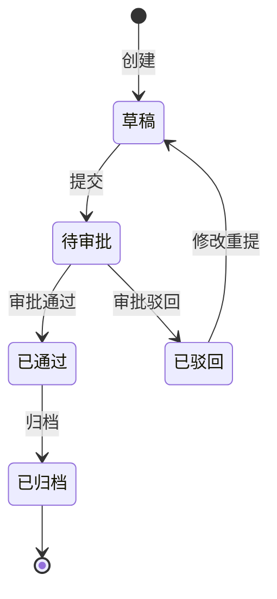
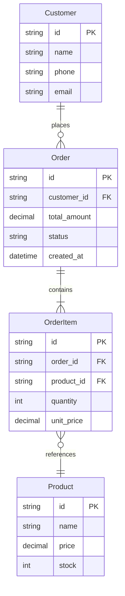

# 数据需求主线

数据需求回答"处理什么数据"的问题，描述系统需要管理的数据及其关系。

## 核心理念

数据需求关注：
- 系统需要管理哪些数据？
- 数据之间有什么关系？
- 数据有哪些属性和约束？

## 领域建模

### 领域模型的作用

- 建立业务领域的共识语言
- 明确核心业务概念
- 指导数据库设计
- 支撑功能需求分析

### 建模层次

```
概念模型（业务视角）
    ↓
逻辑模型（数据视角）
    ↓
物理模型（技术视角）
```

| 层次 | 关注点 | 内容 |
|------|--------|------|
| **概念模型** | 业务概念 | 实体、关系、核心属性 |
| **逻辑模型** | 数据结构 | 属性详情、数据类型、约束 |
| **物理模型** | 数据库实现 | 表结构、索引、分区 |

**需求分析阶段主要关注概念模型**。

---

## 实体识别

### 识别方法

**名词提取法**：
1. 从用例描述中提取名词
2. 筛选有业务意义的名词
3. 合并同义词
4. 区分实体和属性

**示例**：
```
用例描述："客户创建订单，选择商品并填写收货地址"

提取名词：客户、订单、商品、收货地址
分析：
- 客户 → 实体
- 订单 → 实体
- 商品 → 实体
- 收货地址 → 订单的属性或独立实体？
```

### 实体 vs 属性

判断标准：
- **实体**：有独立的生命周期，有多个属性，可被多处引用
- **属性**：依附于实体，简单值类型，不需独立管理

### 实体 vs 值对象

| 特征 | 实体 | 值对象 |
|------|------|--------|
| 标识 | 有唯一标识（ID） | 无唯一标识，用值区分 |
| 生命周期 | 独立 | 依附于实体 |
| 可变性 | 可变 | 通常不可变 |
| 示例 | 用户、订单 | 地址、金额、时间段 |

---

## 关系建模

### 关系类型

| 关系 | 表示 | 示例 |
|------|------|------|
| 一对一 | 1:1 | 用户 - 用户详情 |
| 一对多 | 1:N | 客户 - 订单 |
| 多对多 | M:N | 订单 - 商品 |

### 关系强度

| 类型 | 特征 | 示例 |
|------|------|------|
| **组合** | 整体删除时部分也删除 | 订单 - 订单明细 |
| **聚合** | 整体删除时部分可独立存在 | 部门 - 员工 |
| **关联** | 双方独立存在 | 订单 - 商品 |

### 关系描述模板

```
关系名称：客户-订单关系

类型：一对多
强度：聚合

源实体：客户
目标实体：订单

业务规则：
- 一个客户可以有多个订单
- 订单必须属于一个客户
- 客户删除时，订单保留（标记为历史）
```

---

## 属性定义

### 属性描述要素

| 要素 | 说明 | 示例 |
|------|------|------|
| 名称 | 属性的业务名称 | 订单金额 |
| 数据类型 | 值的类型 | 金额（精度2位） |
| 是否必填 | 是否可为空 | 必填 |
| 默认值 | 未填时的默认值 | 0.00 |
| 取值范围 | 有效值范围 | > 0 |
| 业务规则 | 相关的业务规则 | 不能超过信用额度 |

### 常见数据类型

| 类型 | 说明 | 注意事项 |
|------|------|----------|
| 文本 | 字符串 | 长度限制 |
| 数值 | 整数、小数 | 精度、范围 |
| 金额 | 货币值 | 币种、精度 |
| 日期时间 | 时间点 | 时区处理 |
| 枚举 | 固定选项 | 列举所有值 |
| 布尔 | 是/否 | - |

---

## 数据生命周期

### 状态机设计



### 数据保留策略

| 数据类型 | 保留策略 | 示例 |
|----------|----------|------|
| 交易数据 | 长期保留 | 订单、支付记录 |
| 日志数据 | 定期清理 | 操作日志90天 |
| 临时数据 | 及时清理 | 会话、缓存 |
| 归档数据 | 冷存储 | 历史订单 |

---

## 主数据与参考数据

### 主数据

**定义**：跨系统共享的核心业务数据

**特征**：
- 全局唯一
- 变化缓慢
- 需要治理

**示例**：客户、商品、供应商、组织架构

### 参考数据

**定义**：用于分类和标准化的数据

**特征**：
- 相对固定
- 有标准编码
- 系统间共享

**示例**：国家/地区代码、币种、商品分类、状态码

---

## 领域模型图

使用Mermaid ER图：



---

## 验证清单

- [ ] 核心实体已识别（10-30个）
- [ ] 实体定义清晰、无歧义
- [ ] 实体关系已明确（类型、强度）
- [ ] 关键属性已定义
- [ ] 主数据已识别
- [ ] 参考数据已梳理
- [ ] 数据生命周期已考虑
- [ ] 领域模型图已绘制
