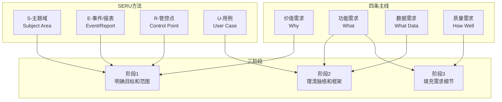

# 需求分析方法论全景图

基于徐峰《有效需求分析（第二版）》的核心方法论框架。

## 核心思想

**业务驱动、用户导向的需求思想**

- 需求 = 预期 - 现状
- "问题级需求"思考意识：先理解问题，再思考解决方案
- 从宏观到微观，从价值到实现

## 方法论框架

---

## 四条主线

需求分析围绕四条主线展开，确保需求的完整性：

| 主线 | 核心问题 | 主要活动 | 输出物 |
|------|----------|----------|--------|
| **价值需求** | 为什么做？ | 目标/愿景分析、干系人分析 | 项目愿景、干系人清单 |
| **功能需求** | 做什么？ | 用例分析、场景梳理 | 用例模型、功能清单 |
| **数据需求** | 处理什么数据？ | 领域建模、数据分析 | 领域模型、数据字典 |
| **质量需求** | 做到什么程度？ | 非功能需求分析 | 质量需求规格 |

**详细指南**：
- [mainlines/value-requirements.md](mainlines/value-requirements.md)
- [mainlines/functional-requirements.md](mainlines/functional-requirements.md)
- [mainlines/data-requirements.md](mainlines/data-requirements.md)
- [mainlines/quality-requirements.md](mainlines/quality-requirements.md)

---

## SERU方法

SERU是一种以业务为驱动的需求分析体系，通过四个维度有机分解需求：

| 维度 | 含义 | 作用 | 对应阶段 |
|------|------|------|----------|
| **S** | Subject Area（主题域） | 按业务职责划分系统边界 | 阶段1 |
| **E** | Event/Report（事件/报表） | 标示业务事件和输出报表 | 阶段1 |
| **R** | Report/Control Point（管控点） | 确定监控和控制节点 | 阶段1 |
| **U** | User Case（用例） | 描述用户交互场景 | 阶段2 |

**详细指南**：
- [seru/subject-area.md](seru/subject-area.md)
- [seru/event-report.md](seru/event-report.md)
- [seru/control-point.md](seru/control-point.md)
- [seru/usecase.md](seru/usecase.md)

---

## 三阶段分析法

### 阶段1：明确目标和范围

**目标**：建立对项目的宏观理解，明确系统边界

**主要活动**：
- 干系人识别与分析
- 目标/愿景分析
- 主题域划分（SERU-S）
- 业务事件识别（SERU-E）
- 管控点识别（SERU-R）

**输出物**：
- 干系人分析文档
- 项目目标和范围说明
- 主题域清单和关系图
- 业务事件清单
- 报表和管控点清单

### 阶段2：理清脉络和框架

**目标**：建立系统的骨架结构

**主要活动**：
- 领域建模（数据需求）
- 用例建模（SERU-U，功能需求）
- 建立用例与实体的关联

**输出物**：
- 领域模型和ER图
- 用例清单和用例图
- 用例概要描述

### 阶段3：填充需求细节

**目标**：完善需求的细节，确保可实现、可测试

**主要活动**：
- 用例细化
- 非功能需求分析
- 业务规则提取
- 约束条件明确

**输出物**：
- 详细用例文档
- 质量需求规格
- 业务规则文档
- 约束条件说明

---

## 方法选择指引

### 按项目规模选择分析深度

| 项目规模 | 建议深度 | 重点关注 |
|----------|----------|----------|
| 小型项目/MVP | quick | 核心用例、基本领域模型 |
| 中型项目 | standard | 完整用例建模、主要非功能需求 |
| 大型系统 | comprehensive | 全面分析、详细文档、严格评审 |

### 按项目类型选择侧重点

| 项目类型 | 侧重主线 | 关键活动 |
|----------|----------|----------|
| 业务系统 | 功能需求 | 用例建模、业务流程 |
| 数据平台 | 数据需求 | 领域建模、数据治理 |
| 高并发系统 | 质量需求 | 性能、可扩展性 |
| 安全敏感系统 | 质量需求 | 安全性、合规性 |

### 敏捷 vs 瀑布

| 方法 | 敏捷项目 | 瀑布项目 |
|------|----------|----------|
| 分析深度 | quick/standard | standard/comprehensive |
| 迭代方式 | 每个Sprint细化当前用例 | 一次性完成全部分析 |
| 文档详细度 | 够用即可，持续演进 | 详细完整，签字确认 |

---

## 术语表

| 术语 | 定义 |
|------|------|
| 干系人 | 与项目相关的所有人员和组织，包括用户、客户、管理者、开发团队等 |
| 主题域 | 按业务职责划分的系统子领域，具有内聚的业务职责 |
| 业务事件 | 触发系统响应的外部或内部事件 |
| 管控点 | 需要监控和控制的业务节点 |
| 用例 | 描述系统与参与者交互的场景 |
| 领域模型 | 描述业务领域中核心概念及其关系的模型 |
| 非功能需求 | 描述系统质量属性的需求，如性能、安全性、可用性等 |
