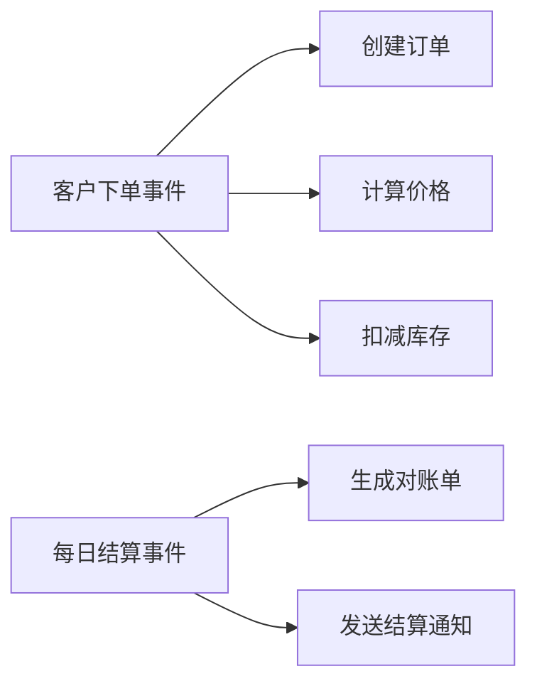

# 事件与报表识别（SERU-E）

业务事件（Event）和报表（Report）是驱动系统运行的关键触发点和输出物。

## 业务事件

### 事件的定义

业务事件是触发系统响应的外部或内部刺激，系统需要对事件做出响应。

### 事件分类

| 类型 | 定义 | 示例 |
|------|------|------|
| **外部事件** | 由外部参与者触发 | 用户下单、客户投诉、供应商发货 |
| **时间事件** | 由时间条件触发 | 每日对账、月度结算、定时报表 |
| **状态事件** | 由系统状态变化触发 | 库存预警、订单超时、余额不足 |

### 事件识别技巧

**3W1H提问法**：
- **Who**：谁触发这个事件？
- **What**：事件发生时需要什么信息？
- **When**：事件在什么条件下发生？
- **How**：系统如何响应这个事件？

**识别步骤**：
1. 从干系人访谈中提取动词短语
2. 从业务流程中提取触发点
3. 从现有系统中提取操作入口
4. 补充时间触发和状态触发事件

### 事件描述模板

```
事件名称：XXX事件

类型：外部事件 / 时间事件 / 状态事件

触发者/条件：
- 外部事件：参与者名称
- 时间事件：触发时间/频率
- 状态事件：触发条件

输入信息：
- 信息1
- 信息2

系统响应：
- 响应动作1
- 响应动作2

频率：高 / 中 / 低
重要性：高 / 中 / 低

所属主题域：XXX域
```

---

## 报表

### 报表的定义

报表是系统输出的信息载体，用于支持决策、监控运营、满足合规要求。

### 报表分类

| 类型 | 用途 | 示例 |
|------|------|------|
| **运营报表** | 日常业务监控 | 每日销售报表、库存报表 |
| **管理报表** | 管理决策支持 | 月度经营分析、客户分析 |
| **财务报表** | 财务核算和审计 | 损益表、资产负债表 |
| **合规报表** | 满足法规要求 | 税务报表、监管报送 |

### 报表识别技巧

**提问清单**：
- 管理层需要看什么数据做决策？
- 运营人员需要监控哪些指标？
- 有哪些法规要求的报送报表？
- 外部合作方需要什么数据对账？

### 报表描述模板

```
报表名称：XXX报表

用途：
- 用途说明

使用者：
- 角色1
- 角色2

主要内容：
- 指标1
- 指标2
- 维度1

更新频率：实时 / 每日 / 每周 / 每月

数据来源：
- 主题域/实体1
- 主题域/实体2

格式要求：
- 在线查看 / PDF导出 / Excel导出

所属主题域：XXX域
```

---

## 事件与用例的关系

事件是用例的触发源，一个事件可能对应多个用例：



**转化规则**：
- 简单事件 → 1个用例
- 复杂事件 → 多个用例（按步骤或分支拆分）
- 多个相关事件 → 1个用例（合并处理）

---

## 验证清单

- [ ] 已识别所有外部参与者的触发事件
- [ ] 已识别定时任务和批处理事件
- [ ] 已识别状态变化触发的事件
- [ ] 每个事件有明确的触发者和响应
- [ ] 关键报表已识别并分类
- [ ] 报表的使用者和更新频率已明确
- [ ] 事件和报表已按主题域归类
