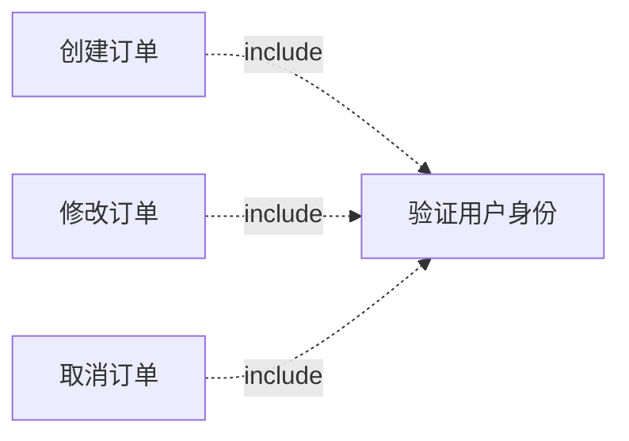
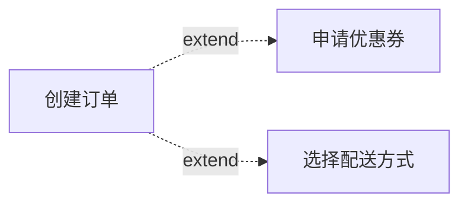
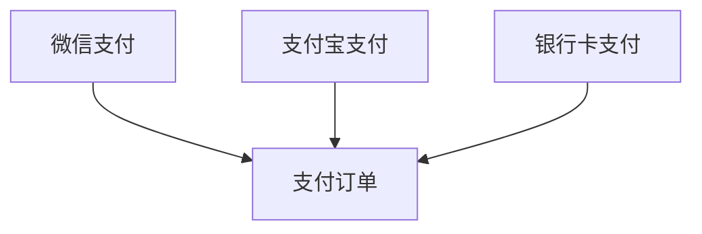
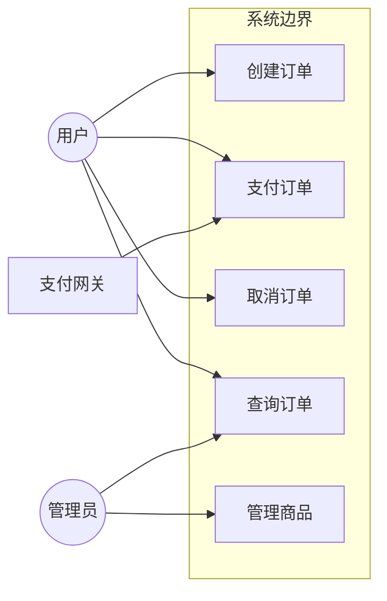

# 用例建模（SERU-U）

用例（Use Case）描述系统与参与者的交互场景，是功能需求的核心表达方式。

## 核心概念

**用例的定义**：
用例是对系统功能的描述，展示系统如何响应参与者的请求，为参与者产生可感知的价值。

**用例的构成要素**：
- **参与者（Actor）**：与系统交互的人员、外部系统或定时器
- **用例名称**：动宾短语，如"创建订单"
- **前置条件**：用例执行前必须满足的条件
- **后置条件**：用例成功执行后系统的状态
- **主成功场景**：正常情况下的执行流程
- **扩展场景**：异常和分支情况的处理

## 参与者识别

### 参与者类型

| 类型 | 说明 | 示例 |
|------|------|------|
| **人员角色** | 直接使用系统的人 | 普通用户、管理员、审批人 |
| **外部系统** | 与系统集成的其他系统 | 支付网关、物流系统、ERP |
| **定时器** | 触发定时任务的时间机制 | 日终批处理、定时对账 |

### 识别技巧

1. 从干系人中筛选直接使用系统的角色
2. 识别系统边界外的集成系统
3. 识别需要定时执行的功能
4. 合并职责相似的角色

## 用例识别

### 从事件推导用例

```
事件 → 系统响应 → 用例

示例：
客户下单事件 → 创建订单、计算价格、生成支付单 → UC: 创建订单
```

### 用例粒度控制

**过大的用例**（需要拆分）：
- 包含多个独立的业务目标
- 执行时间跨度很长
- 涉及多个不同的参与者

**过小的用例**（需要合并）：
- 只是单个操作步骤
- 无法独立为参与者产生价值
- 总是作为其他用例的一部分执行

**合适的粒度**：
- 对应一个完整的业务目标
- 在一次会话中可完成
- 能独立为参与者产生价值

### 用例命名规范

**格式**：动词 + 宾语

**良好示例**：
- 创建订单
- 审批报销单
- 查询库存
- 导出销售报表

**不良示例**：
- 订单管理（太宽泛）
- 点击提交按钮（太具体）
- 订单（缺少动词）

## 用例分类

按功能类型分为三类：

| 类型 | 说明 | 占比建议 |
|------|------|----------|
| **业务支持** | 核心业务流程 | 60-70% |
| **管理支持** | 运营管理、数据管理 | 20-30% |
| **维护支持** | 系统配置、权限管理 | 10-15% |

**业务支持用例示例**：
- 创建订单
- 处理退款
- 发布商品

**管理支持用例示例**：
- 查看销售报表
- 审批订单
- 分配任务

**维护支持用例示例**：
- 配置系统参数
- 管理用户权限
- 查看操作日志

## 用例关系

### 包含关系（include）

当多个用例共享相同的步骤时，将共享部分提取为独立用例。



### 扩展关系（extend）

当某个用例在特定条件下有额外的行为时使用。



### 泛化关系

当多个用例有共同的行为，但各自有特殊化的部分时使用。



## 用例描述模板

```
用例名称：XXX

ID：UC-001
主题域：XXX域
优先级：高 / 中 / 低
类型：业务支持 / 管理支持 / 维护支持

概述：
简要描述用例的目的和范围

参与者：
- 主要参与者：XXX
- 次要参与者：XXX

前置条件：
- 条件1
- 条件2

后置条件：
- 成功时：XXX
- 失败时：XXX

主成功场景：
1. 参与者XXX
2. 系统XXX
3. 参与者XXX
4. 系统XXX

扩展场景：
2a. 如果XXX：
    1. 系统XXX
    2. 返回步骤2

3a. 如果XXX：
    1. 系统XXX
    2. 用例结束

特殊需求：
- 性能：XXX
- 安全：XXX

相关用例：
- 包含：UC-XXX
- 扩展：UC-XXX
```

## 用例图

使用Mermaid绘制用例图：



## 验证清单

- [ ] 所有业务事件已转化为用例
- [ ] 参与者识别完整（人员、系统、定时器）
- [ ] 用例粒度合适（不过大也不过小）
- [ ] 用例命名规范（动宾短语）
- [ ] 用例已分类（业务/管理/维护）
- [ ] 用例关系（include/extend）已标识
- [ ] 每个主题域有足够的用例覆盖
- [ ] 用例图已绘制
