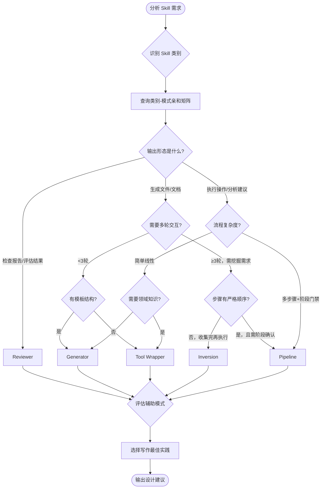

# Agent Skill 设计模式全景

## 三轴分析模型

Skill 设计涉及三个维度的决策：

- **类别**（WHAT）— 你在建什么类型的 skill？功能用途决定了核心价值方向
- **模式**（HOW to organize）— 怎么组织 skill 的结构？架构模式决定了目录布局和流程编排
- **写作实践**（HOW to write well）— 怎么把 skill 写好？写作最佳实践确保高质量输出

类别缩小模式搜索空间，模式确定最终结构，写作实践保障输出质量。

### 9 种 Skill 类别速览

| 类别 | 一句话定义 |
|------|-----------|
| 库与 API 参考 | 说明如何正确使用某个库/CLI/SDK |
| 产品验证 | 测试或验证代码是否正常工作 |
| 数据获取与分析 | 连接数据体系与监控体系 |
| 业务流程与团队自动化 | 把重复性工作流自动化 |
| 代码脚手架与模板 | 生成框架样板代码 |
| 代码质量与审查 | 落实代码质量要求和评审 |
| CI/CD 与部署 | 拉取、推送与部署操作 |
| 运维手册 | 从症状出发的排查链路 |
| 基础设施运维 | 日常维护与运维操作 |

详细定义与识别信号：[categories.md](categories.md)
类别×模式×实践交叉矩阵：[category-pattern-matrix.md](category-pattern-matrix.md)

## 5 种设计模式速览

Google 提出的 5 种 Agent Skill 设计模式，覆盖了从简单工具封装到复杂多步骤流程的全部场景。

| 模式 | 一句话定义 | 最佳适用场景 | 核心特征 |
|------|-----------|-------------|---------|
| **Tool Wrapper** | 让 Agent 按需加载领域知识和规范文档 | 需要引用外部文档/规范，skill 本身逻辑简单 | 渐进加载、按需读取 |
| **Generator** | 用模板驱动结构化文档或代码的生成 | 输出有固定格式，需要模板填充 | 模板驱动、变量替换 |
| **Reviewer** | 用检查清单对内容进行结构化评审 | 代码审查、合规检查、质量评估 | 检查清单、评分输出 |
| **Inversion** | 先采访用户收集完整信息，再执行任务 | 需求不明确，需要多轮交互挖掘 | 采访先行、先收集再执行 |
| **Pipeline** | 严格的多步骤工作流，含阶段检查点 | 复杂顺序流程，需要人工确认 | 多步骤、阶段门禁 |

## 决策流程图

> 此流程图为参考指引，实际分析应基于多维度信号综合判断，而非机械沿图走。大多数真实 skill 是多模式混合的。

## 模式组合矩阵

| 主模式 \ 辅助 | Tool Wrapper | Generator | Reviewer | Inversion | Pipeline |
|-------------|-------------|-----------|----------|-----------|----------|
| **Tool Wrapper** | — | 常见 | 偶尔 | 少见 | 少见 |
| **Generator** | 常见 | — | 常见 | 偶尔 | 少见 |
| **Reviewer** | 常见 | 偶尔 | — | 少见 | 偶尔 |
| **Inversion** | 偶尔 | 常见 | 偶尔 | — | 少见 |
| **Pipeline** | 常见 | 常见 | 常见 | 偶尔 | — |

各模式详细参考：
- [Tool Wrapper](patterns/tool-wrapper.md)
- [Generator](patterns/generator.md)
- [Reviewer](patterns/reviewer.md)
- [Inversion](patterns/inversion.md)
- [Pipeline](patterns/pipeline.md)

模式选择详细指南：[decision-guide.md](decision-guide.md)
ADK → Claude Code 映射详解：[pattern-mapping.md](pattern-mapping.md)
写作最佳实践：[best-practices.md](best-practices.md)
